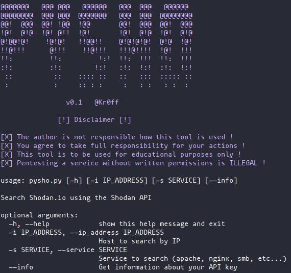

# pysho
------
- Python based tool to perform Shodan queries via the Shodan API



------
Get the tool:
```
git clone https://github.com/Kr0ff/pysho
python -m pip install -r requirements.txt
chmod +x pysho.py
./pysho
------
Example usage:
```
# Perform a check on your Shodan API key
python pysho.py --info
```
[](https://asciinema.org/a/321757)

```
# Perform search for a service or keyword
python pysho.py -s/--search "apache"/"google"
```
[](https://asciinema.org/a/321799)

```
# Perform search for an IP address
python pysho.py -i/--ip_address "8.8.8.8"
```
[](https://asciinema.org/a/321765)

------